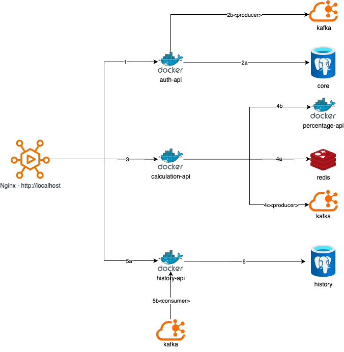

# Tenpo Challenge – Microservices Backend

This project is a solution for the Tenpo technical challenge.  
It implements a microservices-based architecture using modern technologies such as **Spring Boot**, **Kafka**, **Redis**, **PostgreSQL**, and **NGINX**.  
The solution fulfills the requirements for **authentication**, **arithmetic operations**, **call history**, and **rate limiting**.

---

## 📦 Microservices

- **auth-api**: Handles user authentication and JWT token generation.
- **operation-api**: Performs arithmetic operations and percentage application.
- **history-api**: Logs and retrieves API call history.
- **nginx**: Acts as a reverse proxy and applies rate limiting.

---

## 🧪 Features

- ✅ JWT Authentication  
- ✅ Kafka Event Logging  
- ✅ Async History Logging  
- ✅ Rate Limiting (NGINX-based)  
- ✅ Centralized Error Handling  
- ✅ Swagger API Documentation  
- ✅ Docker Compose for local orchestration  

---

## 🗺️ High-Level Architecture

Below is a visual representation of the architecture and the interaction between components:



### 🔁 Flow Summary

1. The **client** initiates **token generation** using previously registered **username** and **password**.
2.  
   a. The provided **credentials** are validated against the **user database**.  
   b. A **Kafka event** is generated with the **request/response** data to be logged **asynchronously**.
3. The **client** uses the **generated token** to send a body with the **numbers to be summed**.
4.  
   a. To perform the **calculation**, the service first checks if the **percentage value** is **cached in Redis** (cached value expires after **30 minutes**).  
   b. If not found in Redis, the **external percentage service** is called, and the value is **stored in Redis**.  
   c. A **Kafka event** is generated with the **request/response** data to be logged.
5.  
   a. The **client** queries the **history** of requests and responses from **`auth-api`** and **`operation-api`**.  
   b. The **events** sent to **Kafka** are consumed by the **`history-api`**.
6. The **consumed events** are **persisted into the database**.


---

## 🛠️ Running the Project

This project uses **Docker** and **Docker Compose** to orchestrate all services and dependencies. Follow these steps to run it on a new environment without any prior setup.

### 1. ✅ Install Prerequisites

Make sure you have the following installed:

- [Docker Engine](https://docs.docker.com/get-docker/)
- [Docker Compose](https://docs.docker.com/compose/install/) (included in Docker Desktop)

Verify the installation:

```bash
docker -v
docker compose version
```

### 2. 📁 Clone the Repository

```bash
git clone https://github.com/jhasidmedrano/tenpo-challenge.git
cd tenpo-challenge
```

> Replace the URL with your actual repository if necessary.

### 3. 🚀 Start the Stack

Use Docker Compose to build and run all services:

```bash
docker compose up --build
```

This will:

- Build the microservices (`auth-api`, `operation-api`, `history-api`)
- Start PostgreSQL, Redis, Kafka, Zookeeper, and NGINX
- Create an internal Docker network (`tenpo-net`)

### 4. 🧪 Example Requests

- `POST /api/1/auth/login` – Generate JWT token
- `POST /api/1/operation/sum` – Perform sum with percentage
- `GET /api/1/history/logs` – Retrieve call history

User for tests:
- username: tenpologin
- password: tenpologin

### 5. ✅ Health Check Endpoints

After the services are up and running, you can verify that each microservice is working properly by calling their **health check endpoints**:

- **Auth API**:  
  `GET http://localhost/api/1/auth/health`

- **Operation API**:  
  `GET http://localhost/api/1/operation/health`

- **History API**:  
  `GET http://localhost/api/1/history/health`

These endpoints return `200 OK` when the service is healthy.

### 🧼 Shut Down the Stack

```bash
docker compose down
```

### 📬 Postman Collection

To simplify testing the APIs, a **Postman collection** is provided:

📁 `tenpo-challenge.postman_collection.json`

This collection includes preconfigured requests for:

- Authentication (`/api/1/auth/login`)
- Token validation (`/api/1/auth/validate`)
- Arithmetic operation (`/api/1/operation/sum`)
- History retrieval (`/api/1/history/logs`)
- Health check endpoints

💡 **Tip:** Make sure the services are running with `docker compose up` before executing the requests.

You can import the collection into Postman via:

- **File → Import → Upload Files**
- Or drag & drop the JSON file into Postman.
